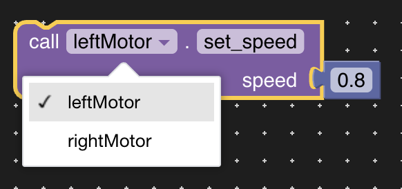
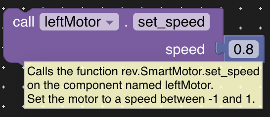
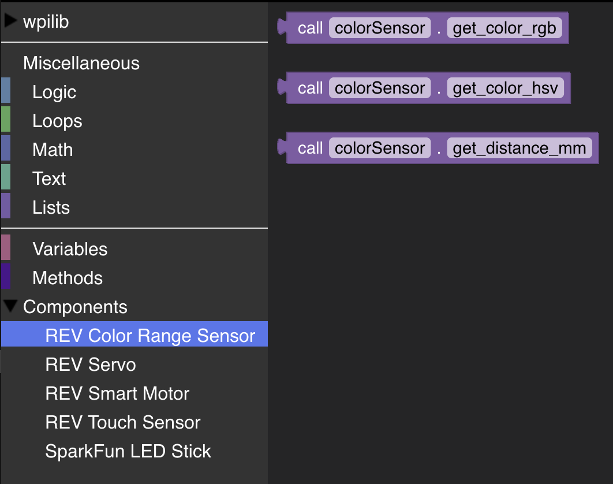
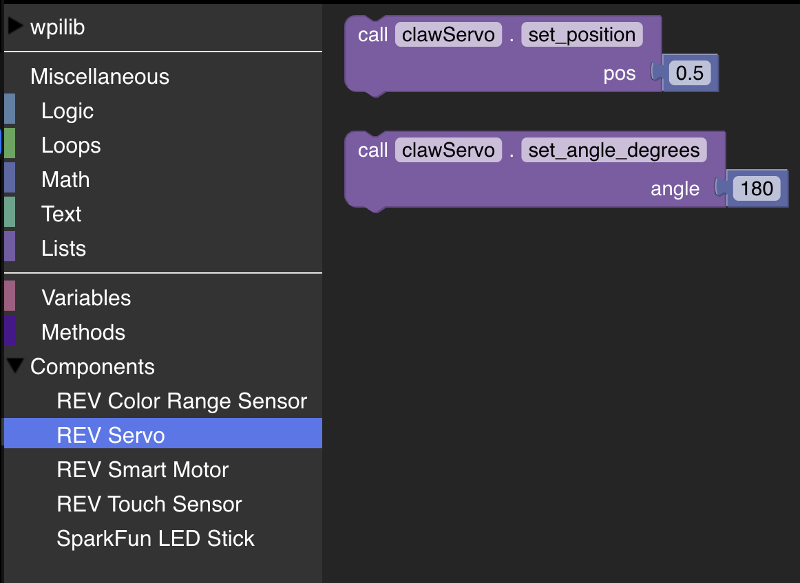
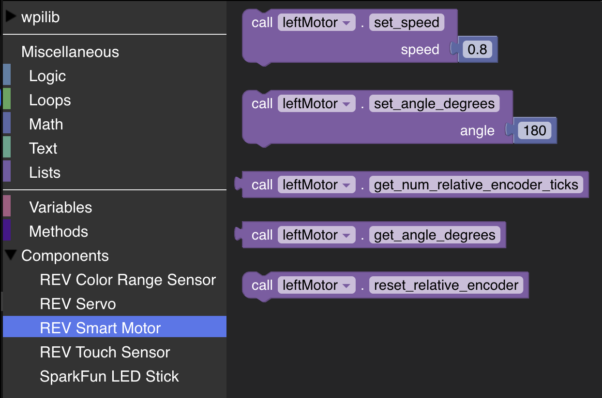
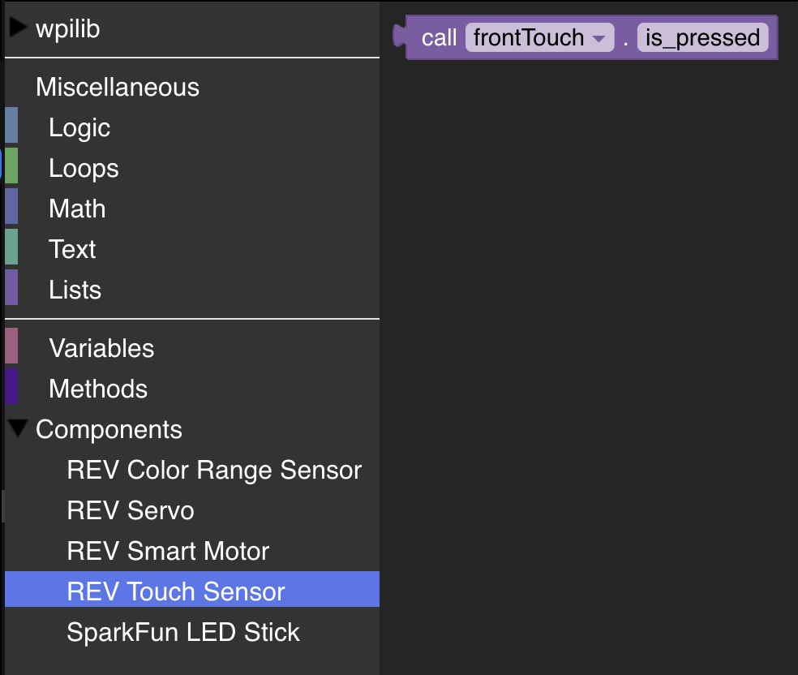
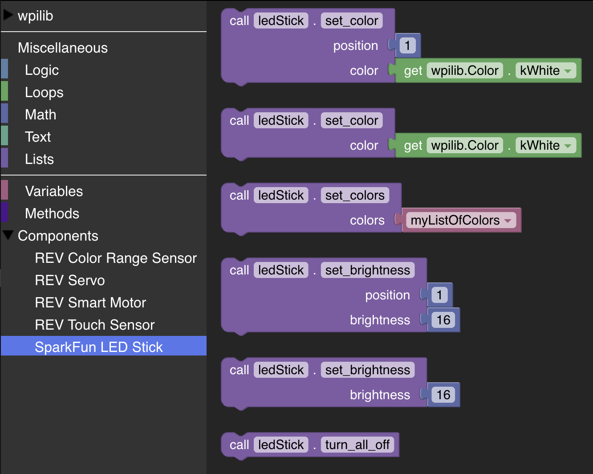

# Component Blocks

## Block Details

### Dropdown shows components of the specific type.

### Tooltip shows that the block calls a method on a component, followed by details about what that method does.

## Component Toolbox Categories

### REV ColorRangeSensor

### REV Servo

### REV SmartMotor

### REV TouchSensor

### SparkFun LEDStick

